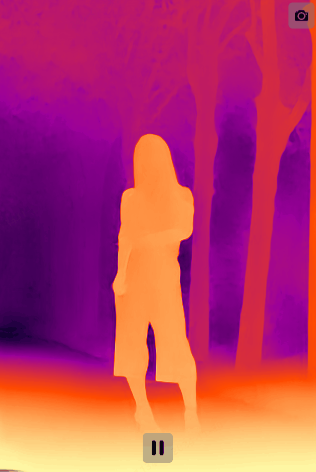
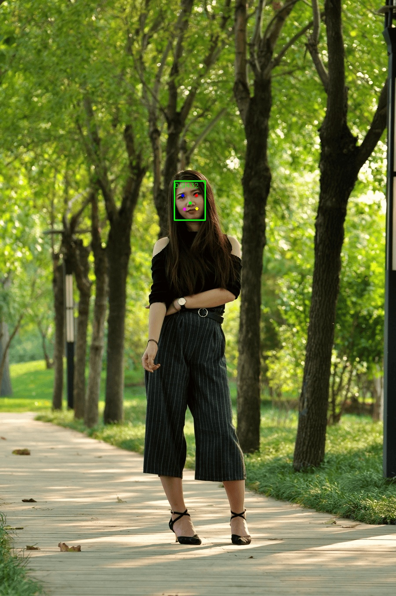

# Depth with OpenGLBokeh ONNX


<p align="center"></p>

<p align="center"></p>

<p align="center"><em>Monocular Depth Estimation with Depth Anything V2</em></p>

<p align="center"></p>

<p align="center"></p>

**run bokeh Demo:**
```shell
$ python mainRenderLUT.py
```

**Depth Inference:**
```shell
$ python dynamo.py
```
**Note**: This version of the code uses the ONNX inference engine.

**Face Detection:**
```shell
$ python libfacedetection/detect.py
```

We observe the following average latencies using the CUDA Execution Provider:

| Device | Encoder | Input Shape | Average Latency (ms) |
| --- | --- | --- | --- |
| RTX4080 12GB | ViT-S | `(1, 3, 518, 518)` | 13.3 |
| RTX4080 12GB | ViT-B | `(1, 3, 518, 518)` | 29.3 |
| RTX4080 12GB | ViT-L | `(1, 3, 518, 518)` | 83.2 |

Relevant framework versions:
```text
CUDA==12.1
cuDNN==8.9.2
onnxruntime-gpu==1.18.0
torch==2.3.1
```
