# 亮度评估

通过综合评估以上几个方面，可以全面了解图像的亮度情况，从而进行进一步的调整和处理。

## 全局（环境）、局部（脸）
1. **全局对比度：** 评估图像整体的亮度对比度，包括亮部和暗部的分布情况（直方图、波形图等）。
2. **动态范围：** 评估图像的亮度动态范围，即图像中最亮和最暗部分的差异程度。
3. **局部对比度：** 评估图像局部区域的亮度对比度，检查是否存在局部细节丢失或过度增强的情况。

## 光的方向
1. **环境光：** 评估图像中环境光的方向分布（主、辅灯等），包括相对光源的位置、方向上亮度情况。
2. **脸部光：** 评估图像中人脸区域的光源方向分布，包括左右脸亮度分布、下巴亮度等情况。

## 涉及直方图定量参数
1. **均值（Mean）：** 表示图像亮度的平均水平，可以通过直方图来计算。
2. **方差（Variance）：** 描述图像亮度值的分散程度，反映了图像亮度的变化、分散情况。
3. **标准差（Standard Deviation）：** 是方差的平方根，同样描述图像亮度分布的常用参数。
4. **偏度（Skewness）：** 描述了亮度分布的偏斜程度，即分布曲线的对称性。是统计数据分布偏斜方向和程度的度量，是统计数据分布非对称程度的数字特征。定义上偏度是样本的三阶标准化矩。
               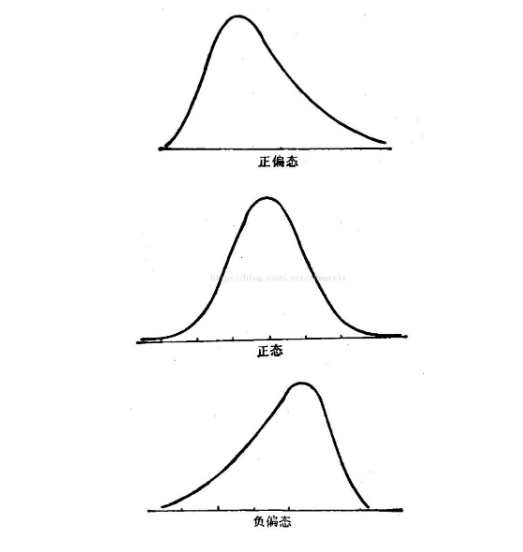
                  直方图的偏度（skewness）可以通过以下公式来计算：
                  \[ \text{Skewness} = \frac{\frac{1}{n} \sum_{i=1}^{n} (x_i - \bar{x})^3}{\left(\frac{1}{n} \sum_{i=1}^{n} (x_i - \bar{x})^2\right)^{\frac{3}{2}}} \]
                  其中，\(x_i\) 是每个数据点，\(\bar{x}\) 是数据的均值，\(n\) 是数据点的数量。
                  _这个公式计算了数据分布的偏斜程度，如果偏度为正，表示数据分布右偏（正偏），如果偏度为负，表示数据分布左偏（负偏），偏度为0表示数据分布大致对称_
5. **峰度（Kurtosis）：** 描述了亮度分布的尖峭程度，即分布曲线的陡峭程度。表征概率密度分布曲线在平均值处峰值高低的特征数。直观看来，峰度反映了峰部的尖度。随机变量的峰度计算方法为：随机变量的四阶中心矩与方差平方的比值。
               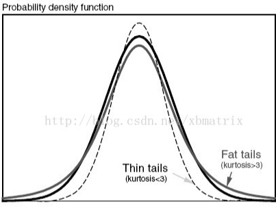
                  直方图的峰度（kurtosis）可以通过以下公式来计算：
                  \[ \text{Kurtosis} = \frac{\frac{1}{n} \sum_{i=1}^{n} (x_i - \bar{x})^4}{\left(\frac{1}{n} \sum_{i=1}^{n} (x_i - \bar{x})^2\right)^{2}} - 3 \]
                  其中，\(x_i\) 是每个数据点，\(\bar{x}\) 是数据的均值，\(n\) 是数据点的数量。
                  _这个公式计算了数据分布的峰度，如果峰度大于3，表示数据分布比正态分布更陡峭（尖峭峰），如果峰度小于3，表示数据分布比正态分布更平缓（平顶峰）_
   
# 肤色影响因素
影像中皮肤颜色的表现受到多种因素的影响。以下是一些主要的因素：
1. **光照条件：** 光照强度和光源的色温会显著影响皮肤颜色的表现。不同光照条件下，皮肤的色调和饱和度可能会发生变化。
2. **相机设置：** 相机的白平衡设置、曝光等参数会影响影像中的颜色表现。不同的相机设置可能导致相同场景下皮肤颜色的差异。
3. **摄影环境：** 拍摄环境的色彩，比如周围物体的颜色和反射，也会对皮肤颜色的感知产生影响。
4. **个体差异：** 不同人群的皮肤颜色存在个体差异，包括肤色的深浅、暖色调和冷色调等。
5. **后期处理：** 图像处理软件或美颜算法的使用会改变皮肤颜色的外观。美颜处理可能调整肤色的明暗、饱和度等，以达到更理想的外观。
6. **传感器特性：** 影像传感器的特性和颜色滤波阵列也可能对皮肤颜色产生影响。
7. **摄影角度：** 摄影角度和拍摄距离也可能改变皮肤颜色在图像中的呈现方式。
考虑到这些因素，理解和处理皮肤颜色时需要综合考虑多个影响因素，以获得准确和真实的皮肤颜色表现。

# 肤色相关指标参数
评价皮肤的亮度情况可以通过观察图像中的皮肤部分并考虑一些指标：
1. **对比度：** 观察皮肤和周围环境的对比度。亮度适中的皮肤应该在图像中清晰可见，而不应太过暗或过于亮眼。
2. **细节保留：** 评估图像中皮肤部分的细节是否得以保留。过度调整亮度可能导致丢失皮肤细节，而不足的亮度可能使皮肤看起来暗淡。
3. **自然感觉：** 亮度调整应该让皮肤看起来自然，避免过度处理导致不真实的效果。皮肤的亮度变化应符合自然光照条件。
4. **色彩平衡：** 评估皮肤的亮度同时考虑其色彩平衡。亮度调整不应影响皮肤的自然色调。
5. **局部调整：** 如果有必要调整亮度，尽量使用局部调整工具，只在需要的区域进行修改，以避免影响整体图像的平衡。
6. **参考样本：** 如果可能，可以参考原始照片中的皮肤区域，确保亮度调整后的皮肤与原始肤色一致。
7. **人工智能处理：** 一些图像编辑软件或人工智能美颜算法可能提供自动亮度调整功能，但需要小心使用，以确保结果自然和符合预期。
总的来说，评价皮肤的亮度情况是一个主观的过程，需要根据具体的图像和需求来判断。自然、真实且符合整体图像的亮度调整通常是理想的目标。

# 肤色亮度
在美颜中，对皮肤颜色亮度准确性的评价可以考虑以下指标：
1. **色调准确性：** 当增加或减少亮度时，图像中的颜色值会相应地发生变化，这可能会导致整体色调的改变。因此，在调节图片亮度时，
                    需要注意可能对图像的色彩产生的影响。美颜处理后皮肤的色调应该保持自然，不应该出现过于偏红、偏黄或其他异常的色调。
2. **饱和度：** 肤色的饱和度应该在适度范围内，不应过分增强或减弱，以避免让皮肤看起来不真实。
3. **明暗层次：** 美颜处理后，皮肤的明暗层次应该得以保留，避免过度平坦的效果。
4. **肤色一致性：** 处理后的皮肤颜色在整个图像中应该保持一致，不应该出现局部色差。
这些指标有助于评估美颜算法在调整皮肤颜色时是否能够保持自然、真实的效果。

## 色调准确性
这两种颜色空间有不同的应用场景。HSL通常用于图像处理中的颜色调整，而YCbCr常用于视频编码和传输中，其中亮度和色度信息可以独立编码，提供了更好的压缩性能。
1. **HSL（色相、饱和度、亮度）**：
   - **色相（Hue）：** 表示颜色的种类，以角度度量，通常取值范围为0到360度。
   - **饱和度（Saturation）：** 表示颜色的鲜艳程度，取值范围为0到1。
   - **亮度（Lightness）：** 表示颜色的明暗程度，取值范围为0到1。
2.  **LAB（色相、饱和度、亮度）**：
这种颜色空间的特点是能够对颜色进行较为均匀的分布，因此在颜色相关的应用中有着广泛的应用。
   - **红绿范围（L）：**表示图像的亮度信息，通常取值范围为0到100。
   - **红绿范围（A）：**表示从红色到绿色的范围，其取值通常是-128到127。
   - **黄蓝范围（B）：**表示从黄色到蓝色的范围，其取值通常是-128到127。
   
3. **YCbCr（亮度、色度蓝、色度红）**：
   - **亮度（Y）：** 表示图像的亮度信息，通常取值范围为0到255。
   - **色度蓝（Cb）：** 表示蓝色通道的颜色信息，通常取值范围为0到255。
   - **色度红（Cr）：** 表示红色通道的颜色信息，通常取值范围为0到255。

4. **统计分析方法 ：**
   - **基于LAB颜色空间：** 
   - 1. 脸部皮肤区域分割。
   - 2. RBG转LAB, 分离通道。
   - 3. 对比试验：准备三通道原图与直方图均衡化后的结果图。
   - 4. 统计LAB中A/B/Average_AB均值。
   - 5. 分析一致性。
   - 6. 分析不同亮度、色度下的相关关系，使用HSL来进行颜色调整。

   皮肤分割：
   

      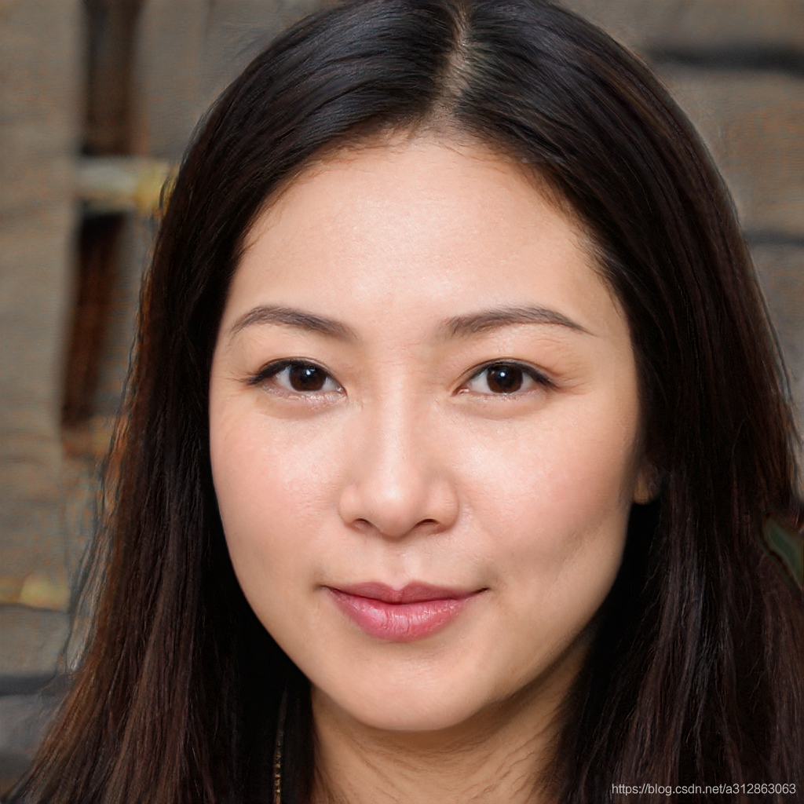
      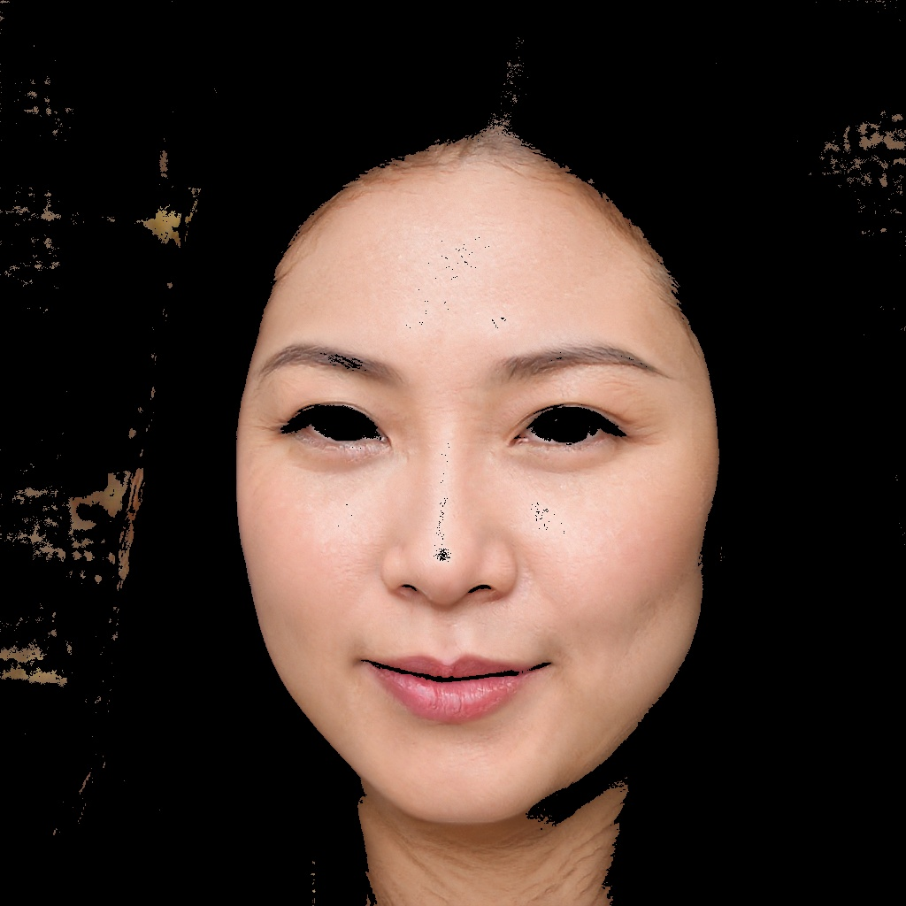
   

   
   从左至右依次是L\A\B通道（原图）：
   

      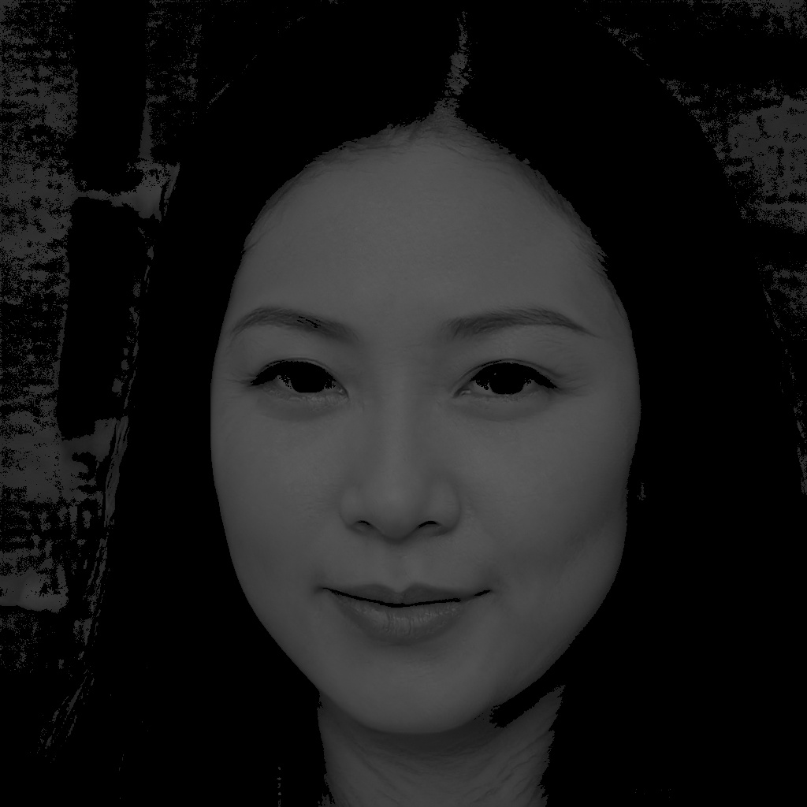
      
      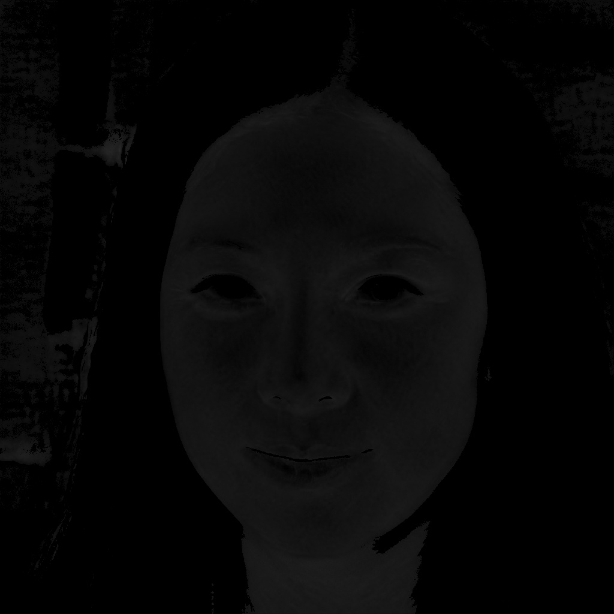
   

   从左至右依次是L\A\B通道（直方图均衡化后）：
   

      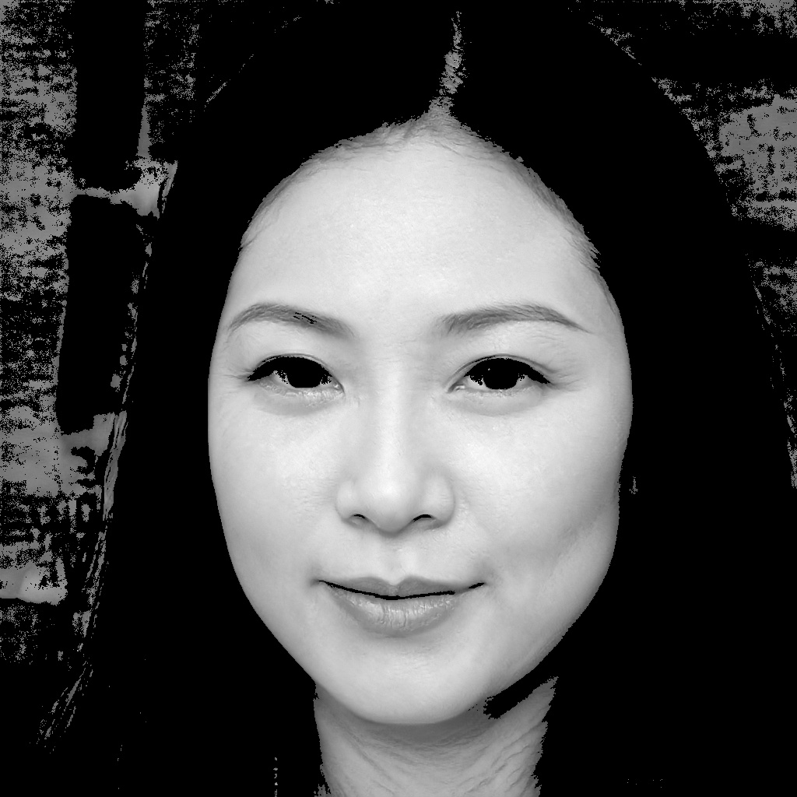
      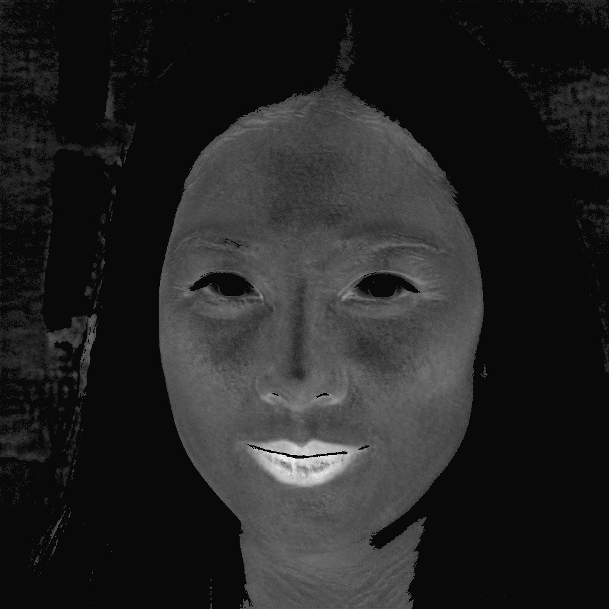
      
   

   统计LAB中A/B/AB均值（原图）：
   

      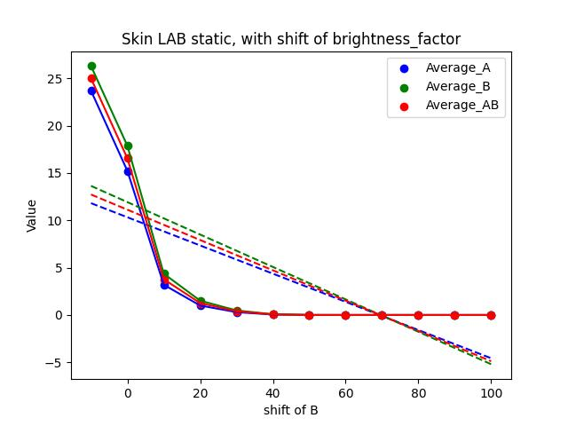
      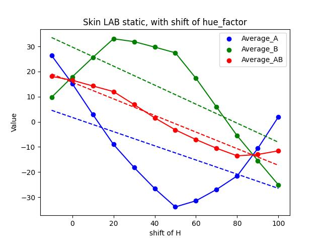
      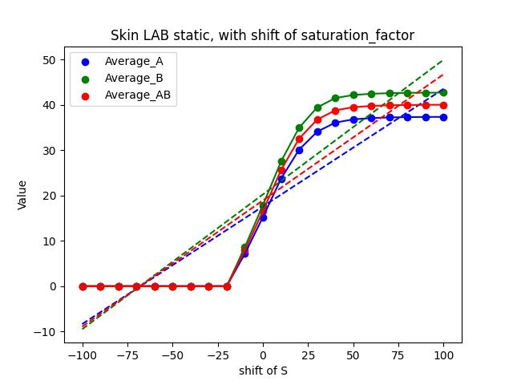
   

   统计LAB中A/B/AB均值（直方图均衡化后）：
   

      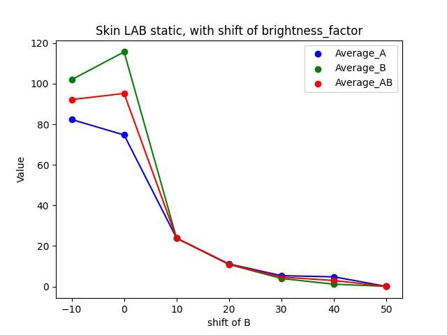
      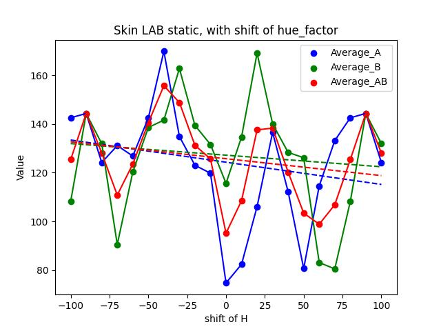
      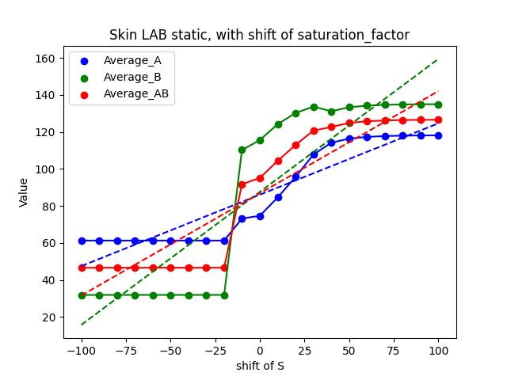
   

   
   - **基于YCbCr颜色空间：** 
   - 1. 脸部皮肤区域分割。
   - 2. RBG转YCbCr, 分离通道。
   - 3. 确定肤色线。在Lab颜色空间中，肤色线的角度通常是指a*轴和b*轴形成的线与水平轴的夹角。
          因此，肤色线的角度为33度，可以表示为从a*轴到b*轴的方向。具体而言，这意味着在Lab颜色空间中，肤色在a*轴和b*轴的坐标为(a, b)。
   - 4. 统计与肤色线法线距离的均值、方差。
   - 5. 分析一致性。
   - 6. 分析不同亮度、色度下的相关关系。
  

## 直方图均衡化作用
直方图均衡化是一种用于增强图像对比度的方法。它的作用包括：
1. **增强图像对比度**：直方图均衡化可以使图像中的暗部和亮部细节更加突出，从而增强图像的对比度。
2. **去除背景噪音**：通过拉伸图像的灰度级分布，直方图均衡化可以减少背景噪音的影响，使图像更清晰。
3. **提高视觉效果**：直方图均衡化可以使图像看起来更加清晰和自然，提高视觉效果。
4. **用于图像增强**：在图像处理中，直方图均衡化常用于增强图像的质量，使得图像更适合于后续的分析和处理。

## （a,b）点到肤色线法线距离：
在Lab颜色空间中，如果有一个点的坐标为(a, b)，而肤色线的角度是33度，你可以计算该点到肤色线的距离。这可以通过计算点到直线的距离来实现。
距离 \(D\) 可以使用以下公式计算：
\[ D = \frac{{\left| (b - \tan(33^\circ) \cdot a) \right|}}{{\sqrt{1 + \tan^2(33^\circ)}}} \]
其中，\( \tan(33^\circ) \) 是肤色线的斜率。
这个公式的分子部分表示点到肤色线的垂直距离，而分母部分用于归一化，以确保距离是点到线的最短距离。最终计算得到的距离值 \(D\) 表示点(a, b)到肤色线的距离。

## 肤色一致性
方差是描述一组数据分布离散程度或波动性的统计量。其物理意义可以通过以下方式理解：
1. **离散程度：** 方差衡量了数据集中个别数据点离散或偏离数据集中心的程度。如果方差较大，说明数据点相对较远离均值，数据分布更分散；反之，方差较小表示数据点更接近均值，数据分布较为集中。
2. **波动性：** 方差也可以看作对数据的波动性的度量。在时间序列或其他数据集中，方差较大的情况可能表示数据值波动较大，而方差较小可能表示波动性较小。
3. **风险度量：** 在金融领域，方差常被用作风险的度量。高方差的资产可能存在更大的价格波动性，因此被视为更风险高的投资。低方差的资产相对稳定，风险较低。
4. **质量控制：** 在制造业或实验研究中，方差用于评估测量值的稳定性和一致性。较小的方差表明测量值更稳定，而较大的方差可能表明存在不一致性或变异。
总体而言，方差是一个关键的统计量，它帮助我们了解数据的分布特征，对比不同数据集的稳定性，并在许多领域中提供了有关数据变异性的重要信息。

（陈帅）直播场景搭建心得：
我对于本次的“直播间搭建搭建知识培训”，主要从以下几个方面有了一定的理解与感悟，这也使得我们相关开发人员在实际开发任务中，能够结合这些注意事项，以便更好地完成任务。
1. 照明：
   一般分为主、辅灯（人物主体补光），可根据实际场景适当增加背景灯（环境光），轮廓补光灯（人物轮廓、发丝与背景分离）搭建5灯直播光照环境。
2. 设备、主体与背景之间的相互距离：
   一般情况下，设备与人物主体、人物主体与背景均保持在1.5m作用（具体根据实际情况调整）。
3. 空间大小对于直播效果的影响：
   在景深较为狭长的场景，各个光源很难对较远场景进行补光；外部太阳光变化对于直播间光照的影响。
   在较为狭小封闭空间，需要注意在绿幕场景下，绿幕白墙一起作用，将绿色光源反射到人物主体上面。
4. 推流设备：
   内置app推流，码率较低。
   一般通过电脑推流，但手电脑性能与网络流畅度影响。
5. 主观画质感受：
   对于清晰度的理解。
   对于质感的理解。
   对于色彩、白平衡的理解。
6. 相关IQ、算法。
7. 用户反馈的问题，以及部分用户为何最终没有选择本产品的原因。
   

