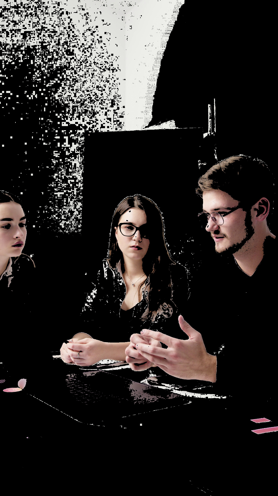
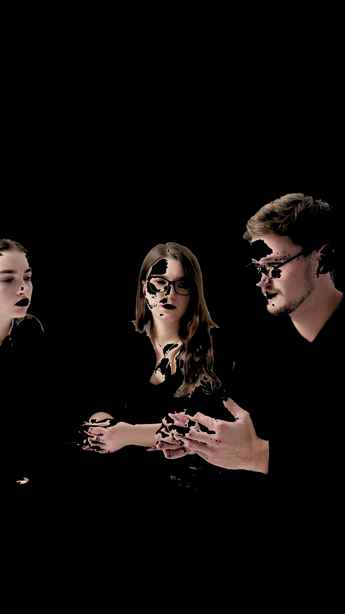
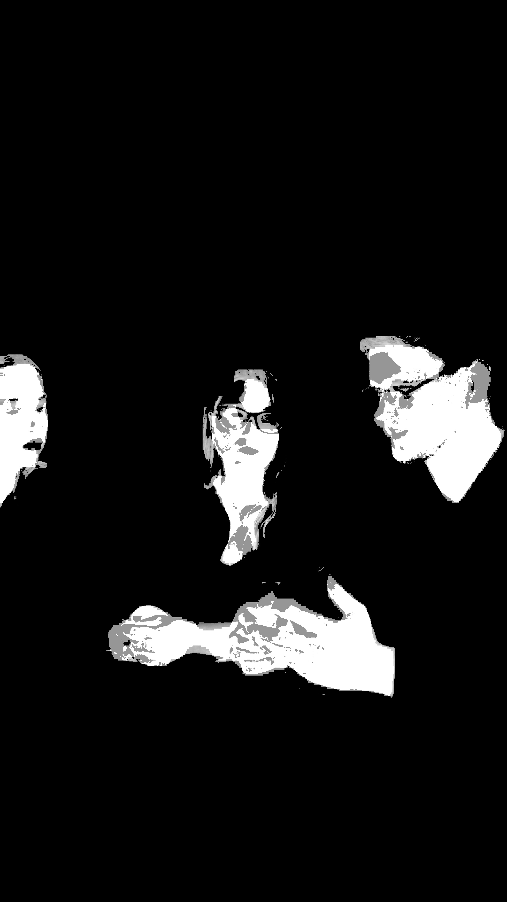
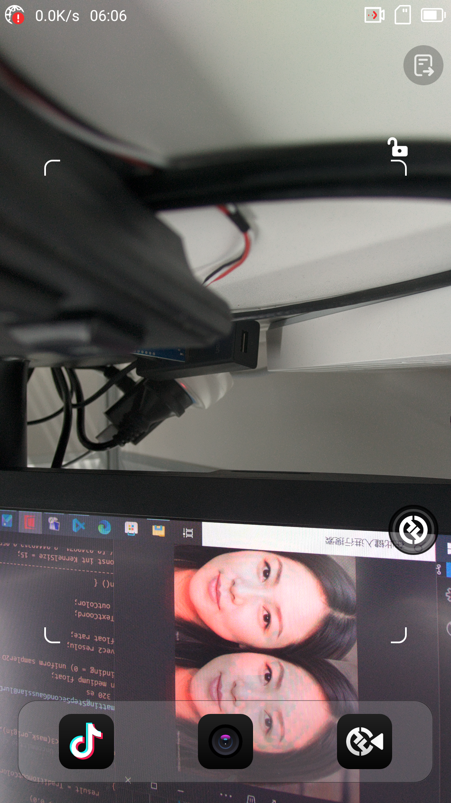
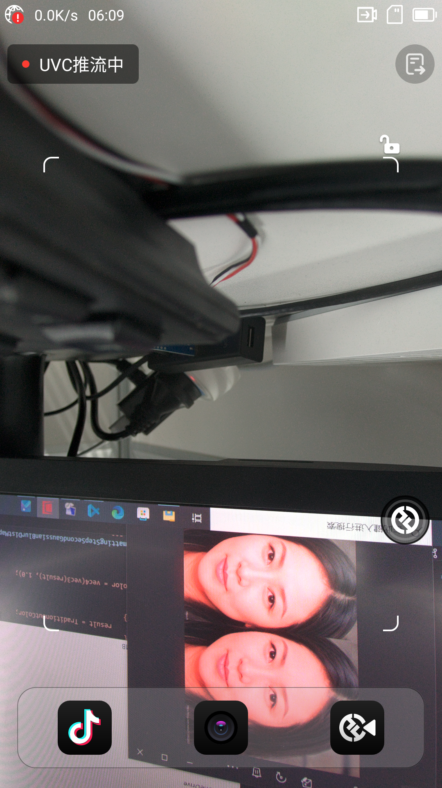

# **AI皮肤分割后渲染处理** 

# 一. 处理目的和处理思路
> - **漏检测**：模型未能完整地识别皮肤区域，使得分割结果缺失部分信息，降低了分割的准确性。
> - **边界不清晰**：漏检测会导致分割结果的边界不连续、不清晰，影响皮肤区域与其他区域的分隔效果，使得分割结果不够精细。
> - **美颜区域影响**：美颜处理边缘过度断层、不平滑，美颜区域不完整，美颜区域闪烁等问题。


## 1. 处理目的
   - AI皮肤分割中存在**漏检测**问题：
        - 如<u>手腕等部位</u>缺失；
        - 皮肤<u>精细边缘</u>信息缺失等。

## 2. 处理思路
   - 结合**传统阈值分割**优化分割效果的方法：
        - 如RGB颜色空间法；
        - YCrCb颜色空间法；
        - HSV颜色空间法；
        - HSV+YCbCr法；
        - HSV+YCbCr阈值优化。

（从左至右依次是*原图*,*RGB颜色空间法*，*HSV颜色空间法*,*YCrCb颜色空间法*）
   <div style="display: flex; justify-content: center;">
      
      
      
      
   </div>
   
   > RGB阈值分割更加宽松，HSV阈值分割更加严格, YCbCr阈值分割效果适中。

   - AI+传统mask融合后处理：
        - 形态学处理；
        - 区域合并；
        - 边缘平滑；

（从左至右依次是*AI原始mask*,*膨胀后*，*AI+传统区域合并*,*边缘平滑*）
   <div style="display: flex; justify-content: center;">
      
      
      
      
   </div>

以下为其他思路，暂未实现。
   - *时间序列法（考虑前后帧间信息）：避免帧间闪烁*


# 二. 处理方法与结果分析
## 1.传统阈值分割优化AI皮肤分割
### 1.具体步骤和原理
   1. 获取原始<u>AI MASK</u>输入、<u>原始图像</u>输入；
   2. 根据原始图像计算<u>传统阈值分割结果</u>；
   3. 形态学处理，<u>膨胀AImask</u>，补充边缘信息；
   4. 传统阈值分割与AI皮肤分割多分割结果<u>融合</u>，精细化边缘信息；
   5. 边缘平滑，<u>高斯滤波</u>；

***融合方法***:

| A |  T  | 皮肤 | 非皮肤 |
|---| --- | --- | --- |
| 0 | =0？ |  -  | √   |
| 0 | !=0? | AIdilated + T | - |
| 1 | =0？ | T | 1-T |
| 1 | !=0? | √   | -   |
|  |  |  |  |

> 注：  
> AI分割结果：A（取值范围：0、1）  
> 传统分割结果：T（取值范围：0.0-1.0）  


# 三. 结果分析

## 1.皮肤分割：   
（*从左至右依次是AI mask结果，融合后结果*）
   <div style="display: flex; justify-content: center;">
      
      
   </div>


## 2.消融试验

``` txt
TODO：
待完成。本周提交。

# 展示使用传统阈值分割优化的AI皮肤分割与原始结果的对比实验结果
# 分析对比实验结果
# 可能的改进、或者致命缺点
```